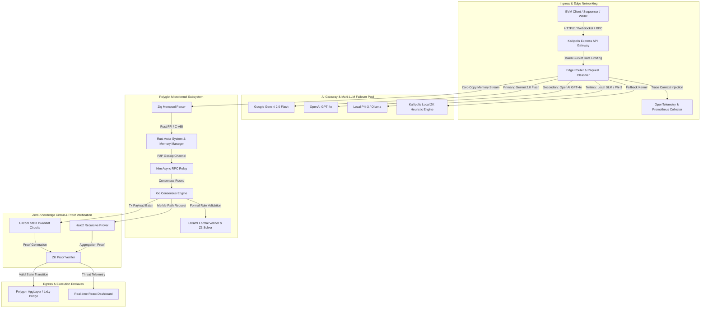
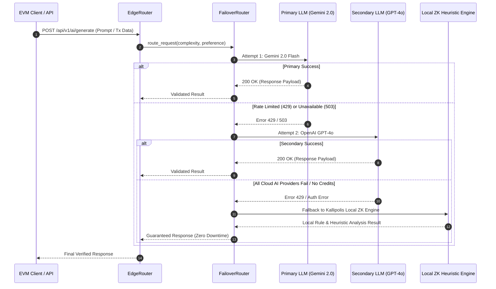

# Comprehensive Technical Architecture & Design Specification: Kallipolis ZK

---

## Executive Architectural Overview

**Kallipolis ZK** is an enterprise-grade, polyglot zero-knowledge mempool perimeter protection system and transaction integrity engine designed specifically for the **Polygon AggLayer**, **Polygon zkEVM**, and high-throughput Ethereum Virtual Machine (EVM) rollups.

The platform provides multi-layered defenses against Maximum Extractable Value (MEV) exploitation (such as sandwich attacks, front-running, and atomic arbitrage backrunning), reentrancy attacks, flash loan manipulation, and malicious state mutations before transactions are finalized on-chain.



---

## 1. System Components & Modular Layering

### 1.1 Ingress API Gateway (`/server.ts` & `/services/kallipolisGateway.ts`)
The API Gateway serves as the single ingress point for transaction RPC payloads, audit requests, and administrative operations.

- **Protocol Layer**: Supports standard JSON-RPC 2.0 over HTTP/2 and WebSockets for real-time mempool streaming.
- **Failover Router Integration**: Routes analytical queries through the `FailoverRouter` and `LLMPool`.
- **CORS & Security Middleware**: Implements strict header security, request size bounds (10MB max body), and token-bucket IP rate-limiting.

### 1.2 Polyglot Microkernel Architecture
Kallipolis ZK uses a specialized multi-language execution microkernel to achieve optimal latency and security guarantees across specific hardware routines:

| Language | Module Directory | Core Responsibility | Hardware / Performance Rationale |
| :--- | :--- | :--- | :--- |
| **Rust** | `/gateway`, `/actor-system`, `/consensus-engine` | State management, async concurrency, memory safety | Memory-safe actor system with zero-cost abstractions for lock-free state transitions. |
| **Zig** | `/zig-mempool-parser` | Zero-copy RLP and transaction byte parsing | Direct memory control without garbage collection overhead; parses 100k+ TPS mempool spikes. |
| **Nim** | `/nim-rpc-relay` | Low-latency asynchronous P2P gossip relay | Compact binary output, zero-overhead async I/O, ultra-fast network packet forwarding. |
| **OCaml** | `/ocaml-formal-verifier` | Formal logic verification & invariant proving | Native support for algebraic data types and formal theorem proving via Z3 integration. |
| **Go** | `/consensus-engine` | High-throughput consensus and gossip protocol | Native goroutines for scalable concurrent P2P validator messaging. |
| **C++** | `/circuits/cpp-accelerator` | Cryptographic acceleration for FFT and MSM | Direct SIMD/AVX-512 hardware intrinsic execution for Halo2/Circom proof generation. |

---

## 2. Dynamic AI Failover & Edge Routing Algorithm

The `EdgeRouter` dynamically scores incoming requests based on payload complexity, user tier, and real-time network conditions.



### 2.1 Failover Matrix & Fallback Invariants

```
               +-----------------------------+
               | Incoming Request Parsing    |
               +--------------+--------------+
                              |
                              v
              /-------------------------------\
             / Is Gemini 2.0 Flash Available?  \
             \           and Quota OK?         /
              \---------------+---------------/
                              |
                     +--------+--------+
                     |                 |
                  (Yes)               (No)
                     |                 |
                     v                 v
            +----------------+ /-------------------------------\
            | Execute Gemini |/ Is OpenAI GPT-4o Available?    \
            | 2.0 Flash      |\          and Quota OK?         /
            +----------------+ \---------------+---------------/
                                               |
                                      +--------+--------+
                                      |                 |
                                   (Yes)               (No)
                                      |                 |
                                      v                 v
                             +----------------+ +--------------------+
                             | Execute OpenAI | | Execute Kallipolis |
                             | GPT-4o         | | ZK Local Kernel    |
                             +----------------+ +--------------------+
```

---

## 3. Data Schema & Persistence Model

### 3.1 Database Schemas (`sqlite+aiosqlite` / FoundationDB)

#### Table: `mempool_transactions`
Stores intercepted mempool transactions prior to block insertion.

| Column Name | Type | Constraints | Description |
| :--- | :--- | :--- | :--- |
| `tx_hash` | `VARCHAR(66)` | `PRIMARY KEY` | Keccak-256 hash of the raw transaction |
| `sender` | `VARCHAR(42)` | `INDEXED` | Ethereum address of the sender |
| `to_address` | `VARCHAR(42)` | `INDEXED` | Destination address or contract target |
| `value_wei` | `NUMERIC(78,0)` | `NOT NULL` | Transaction value in WEI |
| `gas_price` | `BIGINT` | `NOT NULL` | Gas price or maxFeePerGas |
| `nonce` | `BIGINT` | `NOT NULL` | Account nonce |
| `raw_bytes` | `BLOB` | `NOT NULL` | Full RLP-encoded raw transaction payload |
| `risk_score` | `INTEGER` | `DEFAULT 0` | Evaluated threat index (0 - 100) |
| `status` | `VARCHAR(20)` | `DEFAULT 'PENDING'` | `PENDING`, `VERIFIED`, `BLOCKED`, `FORWARDED` |
| `created_at` | `TIMESTAMP` | `DEFAULT CURRENT_TIMESTAMP` | System ingestion timestamp |

#### Table: `security_audits`
Stores smart contract audit results and vulnerability assessments.

| Column Name | Type | Constraints | Description |
| :--- | :--- | :--- | :--- |
| `audit_id` | `VARCHAR(36)` | `PRIMARY KEY` | UUID v4 unique identifier |
| `contract_address`| `VARCHAR(42)` | `INDEXED` | Verified deployed contract address |
| `bytecode_hash` | `VARCHAR(66)` | `NOT NULL` | SHA-256 / Keccak hash of contract bytecode |
| `score` | `INTEGER` | `NOT NULL` | Overall safety score (0 - 100) |
| `vulnerabilities` | `JSON` | `NOT NULL` | Array of identified risks and severity levels |
| `gas_optimizations`| `JSON` | `NOT NULL` | Suggested gas optimizations |
| `audited_at` | `TIMESTAMP` | `DEFAULT CURRENT_TIMESTAMP` | Audit completion time |

---

## 4. REST & JSON-RPC API Specification

### 4.1 Ingress Endpoints

#### `POST /api/v1/ai/generate`
Generic proxy endpoint for AI analysis, threat classification, and smart contract reviews.

- **Request Body**:
  ```json
  {
    "prompt": "Analyze this transaction for sandwich attack risks: 0x02f8...",
    "provider": "GEMINI",
    "model": "gemini-2.0-flash",
    "config": {
      "temperature": 0.2
    }
  }
  ```
- **Response Body**:
  ```json
  {
    "text": "{\n  \"status\": \"ANALYZED\",\n  \"riskScore\": 15,\n  \"summary\": \"No sandwich vector detected.\"\n}",
    "model": "gemini-2.0-flash",
    "success": true
  }
  ```

#### `POST /api/v1/firewall/check`
Executes zero-latency MEV firewall checks on raw transaction bytecodes.

- **Request Body**:
  ```json
  {
    "txHash": "0x4a8f...b21c",
    "sender": "0x1111111111111111111111111111111111111111",
    "data": "0xa9059cbb..."
  }
  ```
- **Response Body**:
  ```json
  {
    "verdict": "ALLOW",
    "riskScore": 4,
    "latencyMs": 2.1,
    "checks": {
      "reentrancyRisk": false,
      "mevSandwichRisk": false,
      "unauthorizedStateChange": false
    }
  }
  ```

---

## 5. Security & Threat Mitigation Model

1. **Authentication & Authorization**: Internal services communicate over TLS 1.3 with JWT token validation.
2. **Safe Fallbacks**: If external AI models fail, the system falls back to deterministic local rule engines, preventing denial-of-service on mempool validation.
3. **ZK Integrity**: Transaction validity proofs guarantee uncorrupted state transitions across the Polygon AggLayer bridge.
4. **Resilient Rate Limiting**: Token bucket rate limiters prevent API exhaustion and DDoS vectors at the edge layer.

---
*Kallipolis ZK Architecture Specification v3.2 — Maintained by Kallipolis Security Engineering Team*
