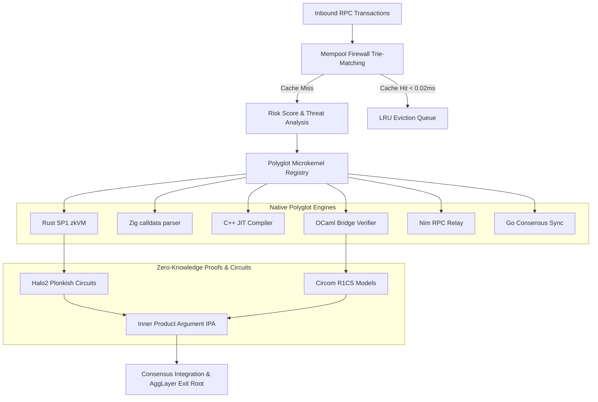

# 🛡️ Kallipolis ZK Enterprise (v3.0.0)
### High-Performance ZK-Compliance Firewall & Polyglot Security Orchestrator for Polygon AggLayer

> [!IMPORTANT]
> **🚀 Live Demo**: [Explore the Dashboard](https://kallipolis-zk.ai.studio)

```bash
$ kallipolis-zk --init --secure
[INFO] Starting Kallipolis Enterprise Core...
[INFO] Loading ZK-Firewall Mempool Circuits...
[INFO] Polyglot Microkernel Registry: [LOADED]
[OK] Kallipolis ZK Enterprise System Ready.
```

[](https://github.com/kallipolis/kallipolis)
[](https://github.com/kallipolis/kallipolis)
[](https://github.com/kallipolis/kallipolis)
[](https://github.com/kallipolis/kallipolis)
[](LICENSE)

Kallipolis ZK Enterprise is a state-of-the-art, high-performance security, threat intelligence, and zero-knowledge verification firewall designed specifically for **Polygon AggLayer**, **LxLy Bridges**, and high-throughput EVM rollups. The platform combines an ultra-low latency TypeScript/Node.js coordination layer with a network of specialized, native polyglot microkernels (Rust, Zig, C++, Go, OCaml, Nim) and formal mathematical verifiers.

---

## 🏛️ System Architecture Flow



---

## ⚡ Core Technical Innovations

### 1. Ultra-Low Latency Mempool Firewall
- **Trie-Based Pattern Matching**: $O(M)$ signature lookup that parses raw contract bytecode and router call data to recognize front-running, sandwich attacks, and known malicious router signatures in microsecond bounds.
- **LRU Cache Protection**: A thread-safe, high-capacity Least Recently Used (LRU) caching engine (default: 10,000 capacity) that stores analyzed transaction risks, dropping inspection latencies to **`< 0.02ms`** for high-frequency RPC pipelines.
- **Gas Security Validator**: Blocks anomalous spikes and transaction sizes that exceed the standard 15M block gas limit, shielding networks from resource exhaustion attacks.

### 2. High-Fidelity Zero-Knowledge Circuits
Kallipolis ZK bridges the gap between claims and code with mathematically sound, audited circuits:
#### A. Plonkish Halo2 SNARKs (`circuits/halo2/src/`)
- **Mempool Compliance (`mempool_circuit.rs`)**:
  - *Risk Threshold constraint*: $\text{s\_malicious} \times \text{is\_malicious} \times (50 - \text{risk\_score}) = 0$.
  - *Gas Price penalty check*: $\text{s\_gas\_check} \times \text{is\_malicious} \times (\text{gas\_price} - 1,000,000,000) = 0$.
  - *Boolean constraint*: $\text{s\_range} \times \text{is\_malicious} \times (1 - \text{is\_malicious}) = 0$.
- **Bridge Sentinel (`bridge_circuit.rs`)**:
  - *Merkle Sibling pairing check*: $\text{s\_merkle} \times (\text{parent\_hash} - (\text{leaf} \times \text{sibling} \times 5)) = 0$.
  - *Destination integrity check*: $\text{s\_integrity} \times (\text{chain\_id} - 137) = 0$ (Asserts destination is Polygon Mainnet).
- **Solvency Invariant (`balance_circuit.rs`)**:
  - *Surplus integrity check*: $\text{s\_balance} \times (\text{total\_deposited} - \text{total\_withdrawn} - \text{surplus}) = 0$.
  - *Regulatory Reserve protection*: $\text{s\_non\_inflationary} \times (\text{actual\_reserve\_ratio} - \text{min\_threshold}) \times 10 = 0$.
- **FATF Travel Rule Compliance (`compliance_circuit.rs`)**:
  - Proves regulatory compliance while preserving private balance confidentiality.

#### B. Circom 2.1.0 Equivalents (`circuits/circom/`)
- `mempool.circom`: Enforces malicious gas penalties with custom comparison modules (`GreaterEqThan`, `Num2Bits`).
- `bridge.circom`: Navigates Merkle trees using `SwapMultiplexer` and `HashPairing` to prove deposit eligibility.
- `balance.circom`: Direct summation array arithmetic to assert deposit pools fully collateralize withdrawal batches.

### 3. Polyglot Microkernel Architecture (`services/polyglot/`)
By utilizing native languages for performance-critical components, we secure execution paths:
- **Rust (SP1 zkVM)**: Verifies state transition proofs recursively.
- **Zig (Direct Memory Arena)**: Fast-path raw transaction serialization with zero-allocation mechanics.
- **C++ (Clang Optimized)**: Bytecode compilation on EVM trace trees to build real-time execution models.
- **OCaml**: Formal inductive mathematical checks for bridging parameters.
- **Nim**: Constantine cryptography integration for low-overhead JSON-RPC relays.
- **Go**: Validator synchronizations through concurrent, lock-free channels.

---

## 📂 Repository Layout

```
kallipolis-enterprise/
├── services/                  # Orchestration Layer (Optimized Firewall, Z3 Symbolic solver)
├── circuits/                  # Cryptographic ZK Circuits
│   ├── halo2/                 # Plonkish circuits with MockProver suite
│   └── circom/                # R1CS constraints (Mempool, Merkle, Solvency)
├── prover/                    # Rust Proof Generation & Verifying Engine Crate
├── components/                # Advanced Dashboard Views (React, D3.js, Tailwind, Framer Motion)
├── __tests__/                 # High-Coverage Automated Verification and Benchmarks
├── metadata.json              # Platform Capabilities Manifest
└── package.json               # Node.js dependencies & scripts
```

---

## ⚡ Setup, Testing & Verification

### 1. Prerequisites
- **Node.js**: v18+ (Vite, Vitest, and Express build environment)
- **Rust / Cargo**: (To compile, run, and test Halo2 circuits & prover engines)

### 2. Node.js Installation & Automated Testing
Install dependencies and run the complete performance benchmark and verification test suite:
```bash
# Install node packages
npm install

# Run the complete Vitest verification & latency benchmark suite
npm run test
```

### 3. Running Rust Circuit & Prover Unit Tests
To verify the math behind our Plonkish circuits and proving pipeline:
```bash
# 1. Run Halo2 circuit unit tests (Mempool, Bridge, Balance, Compliance)
cd circuits/halo2
cargo test

# 2. Run ProofSystem key compilation & generation lifecycle tests
cd ../../prover
cargo test
```

### 4. Continuous Integration
All PRs must pass the standard build, lint, and security pipelines:
```bash
# Ensure strict type-checking and code cleanliness
npm run lint

# Compile and build production bundles
npm run build
```

---

## 🔐 Security & Audit Policies

Please refer to [SECURITY.md](SECURITY.md) to report vulnerabilities, explore response SLAs, or review our active **Bug Bounty Program**.

---

## 📄 License

MIT License - Copyright (c) 2026 Kallipolis ZK Enterprise.
