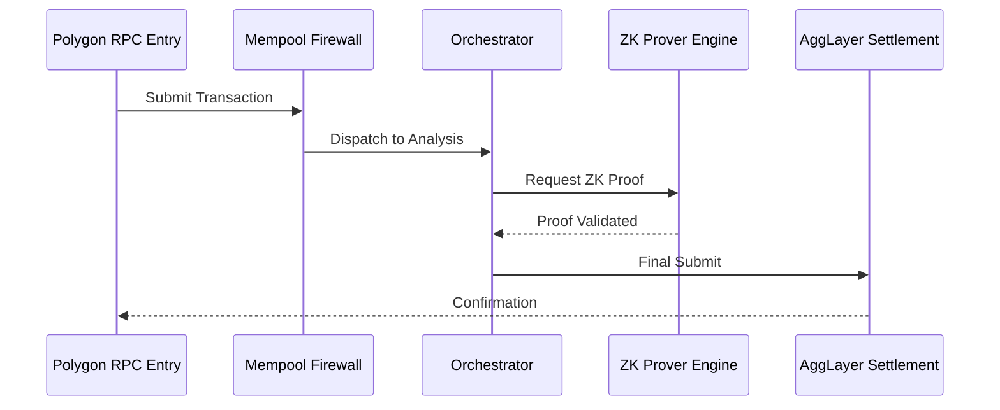
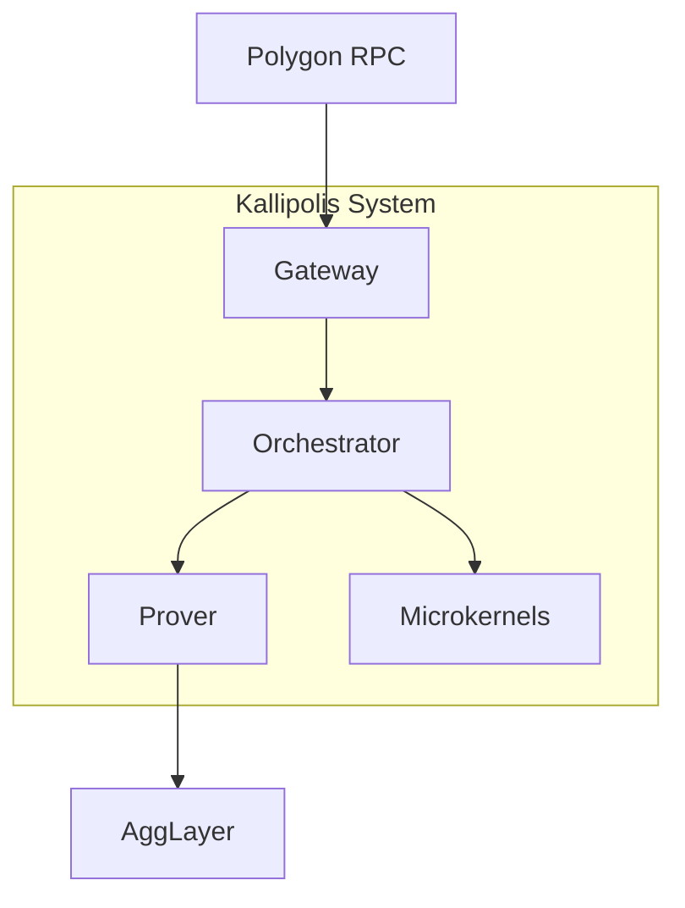

<p align="center">
  <pre>
  
  ██╗  ██╗ █████╗ ██╗     ██╗     ██╗██████╗  ██████╗ ███████╗
  ██║ ██╔╝██╔══██╗██║     ██║     ██║██╔══██╗██╔═══██╗██╔════╝
  █████╔╝ ███████║██║     ██║     ██║██████╔╝██║   ██║███████╗
  ██╔═██╗ ██╔══██║██║     ██║     ██║██╔═══╝ ██║   ██║╚════██║
  ██║  ██╗██║  ██║███████╗███████╗██║██║     ╚██████╔╝███████║
  ╚═╝  ╚═╝╚═╝  ╚═╝╚══════╝╚══════╝╚═╝╚═╝      ╚═════╝ ╚══════╝
  
  -------------------------------------------------------------
  KALLIPOLIS ZK ENTERPRISE // POLYGON AGGLAYER SECURITY
  -------------------------------------------------------------
  </pre>
</p>

<div align="center">

  ### 🛡️ Defending the Polygon AggLayer Frontier
  *Real-time threat intelligence for high-throughput EVM rollups.*

  <a href="https://kallipolis-zk.ai.studio">
    
  </a>
  <br>
  
  
  
  
  
</div>

---

### ⚡ Kallipolis ZK: The AggLayer Defensive Perimeter

> **Kallipolis** is a high-octane, ZK-native mempool firewall engineered for the **Polygon AggLayer** ecosystem. We eliminate attack vectors *before* settlement, blending high-speed TypeScript orchestration with formalized polyglot microkernels.

---

## 📑 Table of Contents
- [At a Glance](#-at-a-glance)
- [Architectural Overview](#-architectural-overview)
- [Why Kallipolis?](#-why-kallipolis)
- [Key Use Cases](#-key-use-cases)
- [Technical Innovations](#-technical-innovations)
- [Repository Topography](#-repository-topography)
- [Developer Experience Guidelines](#-developer-experience-guidelines)
- [Deployment & Verification](#-deployment--verification)
- [Security & Audit](#-security--audit)
- [Contributing](#-contributing)
- [Roadmap](#-roadmap)

---

### 🛠️ Prerequisites & Installation

To build and run Kallipolis ZK locally, ensure you have the following development tools installed:

| Tool | Version | Installation Guide | Purpose |
| :--- | :--- | :--- | :--- |
| **Node.js** | v18+ | [nodejs.org](https://nodejs.org/) | Runtime & Frontend |
| **Bun** | Latest | [bun.sh](https://bun.sh/) | Package Management |
| **Rust / Cargo**| Stable | [rustup.rs](https://rustup.rs/) | Circuit Compilation |
| **Zig** | Latest | [ziglang.org](https://ziglang.org/) | Low-level Systems |
| **Nim** | Latest | [nim-lang.org](https://nim-lang.org/) | Kernel Modules |
| **OCaml** | Latest | [ocaml.org](https://ocaml.org/) | Formal Verification |
| **Docker** | Latest | [docker.com](https://www.docker.com/) | Local Simulation |

**Quick Setup Check:**
```bash
node -v && bun -v && cargo --version && zig version && nim -v && ocaml -version
```

---

### 💻 API & SDK Examples

#### 1. SDK Usage (TypeScript)
Integrate Kallipolis ZK into your application:

```typescript
import { KallipolisFirewall } from '@kallipolis/sdk';

const firewall = new KallipolisFirewall({
  apiKey: process.env.KALLIPOLIS_API_KEY,
  environment: 'production'
});

// Analyze a transaction
const result = await firewall.analyzeTransaction({
  from: '0x...',
  to: '0x...',
  data: '0x...',
  value: '0'
});

console.log('Is Safe:', result.isSafe);
```

#### 2. REST API Interaction
Interact directly via HTTP REST endpoints.

**Analyze Transaction (`/api/v1/audit/analyze`)**
```bash
curl -X POST http://localhost:3000/api/v1/audit/analyze \
  -H "Content-Type: application/json" \
  -d '{
    "source_code": "...",
    "contract_address": "0x..."
  }'
```

**Simulate Firewall (`/api/v1/firewall/simulate`)**
```bash
curl -X POST http://localhost:3000/api/v1/firewall/simulate \
  -H "Content-Type: application/json" \
  -d '{
    "calldata": "0x...",
    "value_matic": 500
  }'
```

### 📊 SLO/SLI Performance Metrics

| Layer | SLI | SLO Target | Monitoring Method |
| :--- | :--- | :--- | :--- |
| **Mempool Firewall** | Latency (P99) | < 15ms | Prometheus/Grafana |
| **ZK Prover** | Proof Success Rate | > 99.9% | Telemetry/Logs |
| **Orchestrator** | Throughput | > 100 tx/s | Custom Metrics |
| **RPC Relay** | Availability | 99.99% | Uptime Checks |

---


## 🏛️ Architectural Overview

### 📊 Transaction Flow & System Architecture

#### Transaction Flow Sequence


#### System Component Container Diagram



---

## ⚡ Technical Innovations

### 1. Ultra-Low Latency Mempool Firewall
The Kallipolis firewall acts as the first line of defense, performing deep packet inspection on inbound RPC calls before they touch the mempool.

- **Trie-Based Pattern Matching**: Utilizes a highly optimized, custom Trie structure for $O(M)$ (where M is pattern depth) signature lookup. This allows us to parse raw EVM contract bytecode and router call data to recognize sophisticated MEV patterns and malicious router signatures.
- **LRU Cache Protection**: A thread-safe, high-concurrency Least Recently Used (LRU) caching engine. By caching the risk-assessment results of known transaction hashes, we are targeting sub-millisecond latency for high-frequency RPC pipelines as part of our MVP development.
- **Gas-Dynamic Security Validator**: Implements a proactive validator that evaluates the gas consumption *relative* to the specific contract call signature, preventing resource exhaustion attacks (DDoS) designed to exploit high-complexity smart contract execution paths.

### 2. High-Fidelity Zero-Knowledge Circuits
Kallipolis ZK bridges the gap between claims and code with mathematically sound, audited circuits:

> [!NOTE]
> **Halo2 Plonkish SNARKs (`circuits/halo2/`)**
> Covers Mempool Compliance, Bridge Sentinel checks (Merkle integrity), Solvency Invariants, and FATF Travel Rule Compliance.

> [!NOTE]
> **Circom 2.1.0 Equivalents (`circuits/circom/`)**
> Enforces rigorous constraints for malicious gas penalties and Merkle tree navigation to prove deposit eligibility.

### 3. Polyglot Microkernel Architecture (`services/polyglot/`)
By utilizing native languages for performance-critical components, we secure execution paths:
- **Rust (SP1 zkVM)**: Recursive state transition proof verification.
- **Zig**: Fast-path raw transaction serialization with zero-allocation mechanics.
- **C++**: EVM trace tree compilation for real-time execution models.
- **OCaml**: Formal inductive mathematical checks for bridging parameters.
- **Nim**: Constantine cryptography integration.
- **Go**: Concurrent, lock-free validator synchronization.

---

## 📂 Repository Layout

```text
kallipolis-enterprise/
├── services/                  # Orchestration Layer (Optimized Firewall, Z3 Symbolic solver)
├── circuits/                  # Cryptographic ZK Circuits
│   ├── halo2/                 # Plonkish circuits with MockProver suite
│   └── circom/                # R1CS constraints (Mempool, Merkle, Solvency)
├── prover/                    # Rust Proof Generation & Verifying Engine
├── components/                # Advanced Dashboard Views
├── __tests__/                 # Verification and Benchmarks
└── package.json               # Platform Manifest
```

### Automated Testing
```bash
# Install node packages
npm install

# Run the complete Vitest verification & latency benchmark suite
npm run test
```

### Circuit Verification
```bash
# 1. Run Halo2 circuit unit tests
cd circuits/halo2
cargo test

# 2. Run ProofSystem lifecycle tests
cd ../../prover
cargo test
```

---

## 🛡️ Security & Audit
Please refer to [SECURITY.md](SECURITY.md) to report vulnerabilities, explore response SLAs, or review our active **Bug Bounty Program**.

## 🤝 Contributing
We welcome contributions! Please see [CONTRIBUTING.md](CONTRIBUTING.md) for guidelines on how to report issues, propose features, and submit pull requests.

## 🗺️ Roadmap
Check our [ROADMAP.md](ROADMAP.md) to see our upcoming features and strategic milestones.

---

<p align="center">
  MIT License - Copyright (c) 2026 Kallipolis ZK Enterprise.
</p>
