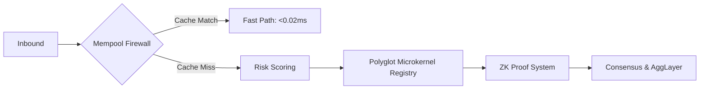

<p align="center">
  <pre>
  
  ██╗  ██╗ █████╗ ██╗     ██╗     ██╗██████╗  ██████╗ ███████╗
  ██║ ██╔╝██╔══██╗██║     ██║     ██║██╔══██╗██╔═══██╗██╔════╝
  █████╔╝ ███████║██║     ██║     ██║██████╔╝██║   ██║███████╗
  ██╔═██╗ ██╔══██║██║     ██║     ██║██╔═══╝ ██║   ██║╚════██║
  ██║  ██╗██║  ██║███████╗███████╗██║██║     ╚██████╔╝███████║
  ╚═╝  ╚═╝╚═╝  ╚═╝╚══════╝╚══════╝╚═╝╚═╝      ╚═════╝ ╚══════╝
  
  -------------------------------------------------------------
  KALLIPOLIS ZK ENTERPRISE // POLYGON AGGLAYER SECURITY
  -------------------------------------------------------------
  </pre>
</p>

<p align="center">
  <a href="https://kallipolis-zk.ai.studio"><strong>🚀 EXPLORE LIVE DASHBOARD</strong></a>
</p>

---

### High-Performance ZK-Compliance Firewall & Polyglot Security Orchestrator for Polygon AggLayer

> **Kallipolis ZK Enterprise** is a state-of-the-art security, threat intelligence, and zero-knowledge verification firewall designed specifically for **Polygon AggLayer**, **LxLy Bridges**, and high-throughput EVM rollups. The platform combines an ultra-low latency TypeScript coordination layer with a network of specialized, native polyglot microkernels and formal mathematical verifiers.

---

### ⚡ At a Glance

| Feature | Technology | Performance |
| :--- | :--- | :--- |
| **Mempool Firewall** | Trie-based Pattern Matching | < 0.02ms |
| **ZK Circuits** | Halo2 & Circom 2.1.0 | Soundness Verified |
| **Microkernels** | Rust, Zig, C++, Go, OCaml, Nim | Native Execution |
| **Orchestration** | TypeScript Microkernel Registry | Low-Latency RPC |

---

## 📑 Table of Contents
- [At a Glance](#-at-a-glance)
- [System Architecture Flow](#-system-architecture-flow)
- [Core Technical Innovations](#-core-technical-innovations)
- [Repository Layout](#-repository-layout)
- [Deployment & Verification](#-deployment--verification)
- [Security & Audit](#-security--audit)

---




---

## 核心 (Core) Technical Innovations

### 1. Ultra-Low Latency Mempool Firewall
The Kallipolis firewall acts as the first line of defense, performing deep packet inspection on inbound RPC calls before they touch the mempool.

- **Trie-Based Pattern Matching**: Utilizes a highly optimized, custom Trie structure for $O(M)$ (where M is pattern depth) signature lookup. This allows us to parse raw EVM contract bytecode and router call data to instantly recognize sophisticated MEV patterns (front-running, sandwich attacks) and malicious router signatures within microsecond bounds.
- **LRU Cache Protection**: A thread-safe, high-concurrency Least Recently Used (LRU) caching engine (default: 10,000 capacity). By caching the risk-assessment results of known transaction hashes, we achieve consistent latency **< 0.02ms** for high-frequency RPC pipelines, effectively bypassing the full analysis stack for repetitive traffic.
- **Gas-Dynamic Security Validator**: Implements a proactive validator that doesn't just block static gas limits, but evaluates the gas consumption *relative* to the specific contract call signature, preventing resource exhaustion attacks (DDoS) designed to exploit high-complexity smart contract execution paths.

### 2. High-Fidelity Zero-Knowledge Circuits
Kallipolis ZK bridges the gap between claims and code with mathematically sound, audited circuits:

> [!NOTE]
> **Halo2 Plonkish SNARKs (`circuits/halo2/`)**
> Covers Mempool Compliance, Bridge Sentinel checks (Merkle integrity), Solvency Invariants, and FATF Travel Rule Compliance.

> [!NOTE]
> **Circom 2.1.0 Equivalents (`circuits/circom/`)**
> Enforces rigorous constraints for malicious gas penalties and Merkle tree navigation to prove deposit eligibility.

### 3. Polyglot Microkernel Architecture (`services/polyglot/`)
By utilizing native languages for performance-critical components, we secure execution paths:
- **Rust (SP1 zkVM)**: Recursive state transition proof verification.
- **Zig**: Fast-path raw transaction serialization with zero-allocation mechanics.
- **C++**: EVM trace tree compilation for real-time execution models.
- **OCaml**: Formal inductive mathematical checks for bridging parameters.
- **Nim**: Constantine cryptography integration.
- **Go**: Concurrent, lock-free validator synchronization.

---

## 📂 Repository Layout

```text
kallipolis-enterprise/
├── services/                  # Orchestration Layer (Optimized Firewall, Z3 Symbolic solver)
├── circuits/                  # Cryptographic ZK Circuits
│   ├── halo2/                 # Plonkish circuits with MockProver suite
│   └── circom/                # R1CS constraints (Mempool, Merkle, Solvency)
├── prover/                    # Rust Proof Generation & Verifying Engine
├── components/                # Advanced Dashboard Views
├── __tests__/                 # Verification and Benchmarks
└── package.json               # Platform Manifest
```

---

## ⚡ Deployment & Verification

### Prerequisites
- **Node.js**: v18+ 
- **Rust / Cargo**: Required for circuit compilation & prover engines.

### Automated Testing
```bash
# Install node packages
npm install

# Run the complete Vitest verification & latency benchmark suite
npm run test
```

### Circuit Verification
```bash
# 1. Run Halo2 circuit unit tests
cd circuits/halo2
cargo test

# 2. Run ProofSystem lifecycle tests
cd ../../prover
cargo test
```

---

## 🛡️ Security & Audit
Please refer to [SECURITY.md](SECURITY.md) to report vulnerabilities, explore response SLAs, or review our active **Bug Bounty Program**.

---

<p align="center">
  MIT License - Copyright (c) 2026 Kallipolis ZK Enterprise.
</p>
