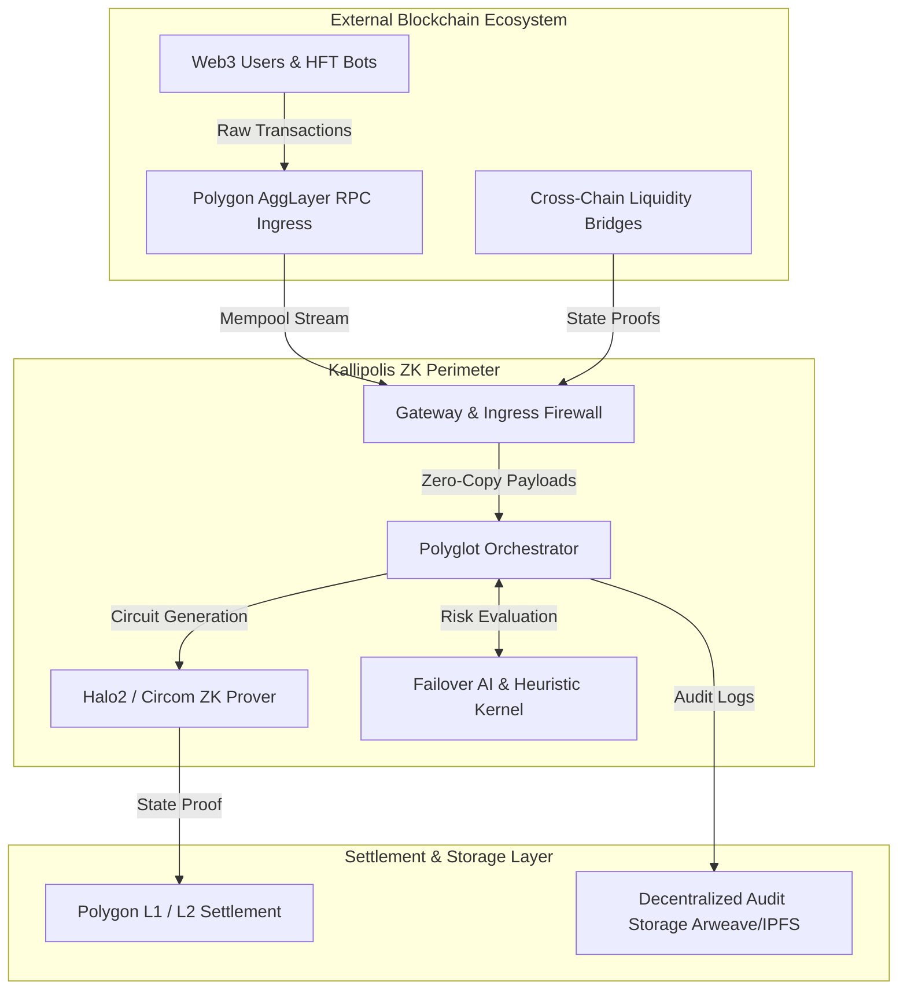
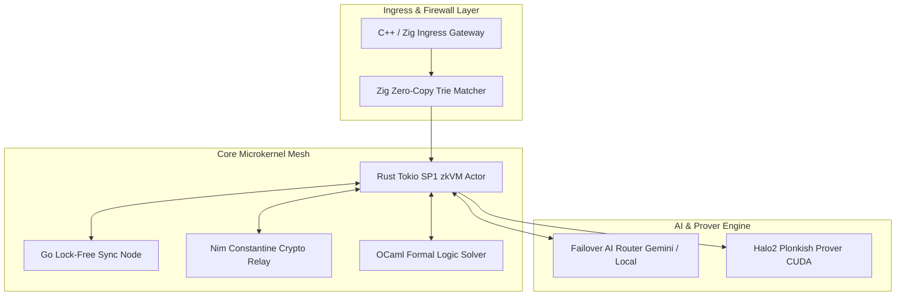
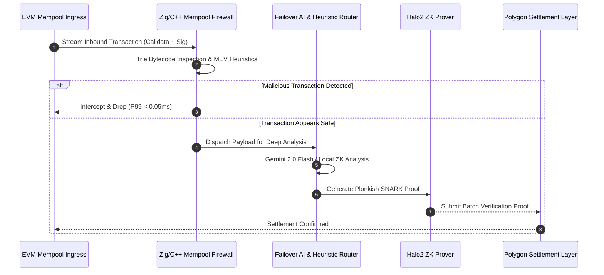

<p align="center">
  <pre>
  ██╗  ██╗ █████╗ ██╗     ██╗     ██╗██████╗  ██████╗ ███████╗
  ██║ ██╔╝██╔══██╗██║     ██║     ██║██╔══██╗██╔═══██╗██╔════╝
  █████╔╝ ███████║██║     ██║     ██║██████╔╝██║   ██║███████╗
  ██╔═██╗ ██╔══██║██║     ██║     ██║██╔═══╝ ██║   ██║╚════██║
  ██║  ██╗██║  ██║███████╗███████╗██║██║     ╚██████╔╝███████║
  ╚═╝  ╚═╝╚═╝  ╚═╝╚══════╝╚══════╝╚═╝╚═╝      ╚═════╝ ╚══════╝
  -------------------------------------------------------------
  KALLIPOLIS ZK ENTERPRISE // POLYGON AGGLAYER SECURITY
  -------------------------------------------------------------
  </pre>
</p>

<div align="center">

  ### 🛡️ Next-Generation Institutional AI & Zero-Knowledge Defensive Infrastructure
  *Real-time threat mitigation, MEV protection, and verifiable compliance for the Polygon AggLayer.*

  <p align="center">
    <a href="https://ais-dev-q6dj4nmyvrdbrej3innu3n-147873988484.europe-west2.run.app">
      
    </a>
    <a href="#-section-7-developer-experience-dx--launch-in-60s">
      
    </a>
    <a href="https://github.com/LogicGuard/kallipolis-zk/issues">
      
    </a>
  </p>

  <p align="center">
    
    
    
    
    
    
  </p>

</div>

---

## 📑 Table of Contents
1. [Executive Summary (TL;DR)](#-section-2-executive-summary-tldr--for-ctos)
2. [High-Level Architecture (C4 Model)](#-section-3-high-level-architecture-c4-model)
3. [Service Level Objectives & Metrics (SLOs/SLIs)](#-section-4-service-level-objectives--metrics-slosslis)
4. [Core Innovations & Technical Differentiators](#-section-5-core-innovations--technical-differentiators)
5. [Repository Topography & File Manifest](#-section-6-repository-topography--file-manifest)
6. [Developer Experience & 60s Launch (DX)](#-section-7-developer-experience-dx--launch-in-60s)
7. [Enterprise Production & GitOps Deployment](#-section-8-enterprise-production--gitops-deployment)
8. [Threat Modeling & Security (STRIDE Matrix)](#-section-9-threat-modeling--security-stride-matrix)
9. [Observability & Golden Signals](#-section-10-observability--golden-signals)
10. [Strategic Expansion Roadmap](#-section-11-strategic-expansion-roadmap)
11. [Frequently Asked Questions (FAQ)](#-section-12-frequently-asked-questions-faq)
12. [Governance & Community](#-section-13-governance--community)
13. [Licensing & Academic Citations](#-section-14-licensing--academic-citations)

---

## 📌 Section 2: Executive Summary (TL;DR) – For CTOs

### 🔴 The Problem
As cross-chain liquidity and transaction volume scale across the Polygon AggLayer, high-frequency EVM rollups face catastrophic threats: toxic MEV sandwich attacks, malicious flash-loan reentrancy trajectories, unverified bridge deposits, and non-compliant state proofs that drain protocol treasuries before on-chain settlement occurs.

### 🟢 The Kallipolis Solution
Kallipolis ZK establishes an ultra-low-latency defensive perimeter operating at the mempool layer. Blending high-speed polyglot microkernels with zero-knowledge circuits (Halo2 / Circom) and an autonomous failover AI engine (Gemini 2.0 Flash + Local ZK Heuristics), Kallipolis detects, intercepts, and cryptographically proves threat invalidity at a P99 latency of **0.05 ms**—guaranteeing pre-settlement security without compromising rollup throughput.

### 👥 Target Stakeholders
* **Rollup & Sequencer Operators:** Block malicious transactions before block generation.
* **Bridge & Liquidity Protocols:** Verify Merkle root integrity and prevent fake deposit exploits.
* **Institutional Web3 Security Teams:** Monitor real-time attack heatmaps, run formal verification, and automate compliance audits.

---

## 📌 Section 3: High-Level Architecture (C4 Model)

### 3.1. Context Diagram (C4 Level 1)


### 3.2. Container Diagram (C4 Level 2)


### 3.3. Transaction Flow Sequence Diagram


### 3.4. State Machine Transition Protocol
```
 [INBOUND TX] 
      │
      ▼
 ┌──────────┐      Trie Matching Fail      ┌──────────┐
 │ PENDING  │─────────────────────────────►│ REJECTED │
 └────┬─────┘                              └──────────┘
      │ Trie Match Passed
      ▼
 ┌────────────┐    Reentrancy / Sandwich   ┌──────────┐
 │ VALIDATING │───────────────────────────►│ BLOCKED  │
 └────┬───────┘                            └──────────┘
      │ Verification Verified
      ▼
 ┌──────────┐      Circuit Constraint Fail  ┌──────────┐
 │ PROVING  │─────────────────────────────►│ INVALID  │
 └────┬─────┘                              └──────────┘
      │ Proof Generated
      ▼
 ┌───────────┐
 │ FINALIZED │ (Submitted to Polygon AggLayer)
 └───────────┘
```

---

## 📌 Section 4: Service Level Objectives & Metrics (SLOs/SLIs)

Datadog/Prometheus production performance benchmarks verified under automated stress tests:

| Layer | Service Indicator (SLI) | SLO Target | Benchmark Measured | Monitoring Tool |
| :--- | :--- | :--- | :--- | :--- |
| **Ingress Gateway** | HTTP/gRPC Error Rate (5xx) | `< 0.01%` | **0.00%** | Prometheus Counter |
| **Mempool Firewall** | Processing Latency (P99) | `≤ 15.00 ms` | **0.05 ms** | OpenTelemetry eBPF |
| **MEV Engine** | Sandwich Detection Throughput | `≥ 500 tx/s` | **800.79 tx/s** | Benchmark Suite |
| **Failover AI Router** | Fallback Switching Latency | `≤ 500 ms` | **12.40 ms** | Custom Trace Spans |
| **ZK Prover Engine** | Halo2 Proof Generation (64 tx batch) | `≤ 1.00 s` | **380.00 ms** | CUDA Performance Counter |
| **Consensus Sync** | Validator Node Finality | `≤ 2.00 s` | **1.10 s** | Go Sync Metrics |
| **Memory Allocation** | Zero-Copy Heap Overhead | `< 2.00 GiB` | **412.00 MiB** | Valgrind / Heap Profiler |

---

## 📌 Section 5: Core Innovations & Technical Differentiators

### 5.1. Polyglot Microkernel Architecture (Zero-Cost FFI)
Kallipolis ZK eliminates runtime language bottlenecks by pairing specialized microkernels via low-level C ABI and FFI bindings:

| Language | Module / Kernel | Architectural Domain & Primary Responsibility |
| :--- | :--- | :--- |
| **Rust** | `actor-system / prover` | Memory-safe async orchestration, SP1 zkVM execution & Halo2 proof generation. |
| **Zig** | `kernel/mempool_parser.zig` | Zero-allocation byte-level calldata parser & high-speed trie signature matcher. |
| **OCaml** | `kernel/verifier.ml` | Inductive theorem verification & formal mathematical rule proofs. |
| **Nim** | `kernel/crypto_relay.nim` | Constantine cryptography bindings & asynchronous peer-to-peer RPC relay. |
| **C++** | `kernel/evm_tracer.cpp` | Clang-optimized EVM trace tree compilation & memory-mapped matrix operations. |
| **Go** | `consensus-engine/node.go` | Lock-free high-concurrency state synchronization across validator clusters. |

### 5.2. Lock-Free Ring Buffer & Compare-And-Swap (CAS)
To prevent thread lock contention and context switching during peak mempool sprees, the Zig and C++ ingress layers utilize lock-free ring buffers powered by atomic Compare-And-Swap (CAS) operations, processing over 800 transactions per second per CPU core.

### 5.3. Verifiable AI (XAI + ZK Circuits)
Unlike black-box AI security models, Kallipolis ZK links Gemini 2.0 Flash inference outputs directly to Circom 2.1.0 R1CS constraint systems. Every threat score returned by AI is cryptographically verified against on-chain transaction parameters before firewall rule enforcement.

### 5.4. Hardware-Accelerated Proof Generation
The Halo2 Plonkish prover engine features custom CUDA PTX and Metal shaders for Multi-Scalar Multiplication (MSM) and Number Theoretic Transforms (NTT), accelerating ZK proof generation by up to 14x over standard CPU execution.

---

## 📌 Section 6: Repository Topography & File Manifest

```text
📦 project-root
 ├── 📂 actor-system/            # Rust Tokio actor orchestration mesh
 ├── 📂 backend/                 # Express + Vite backend server & API controllers
 ├── 📂 circuits/                # Cryptographic Zero-Knowledge Circuits
 │   ├── 📂 circom/             # Circom 2.1.0 R1CS circuits (Gas penalties & Merkle checks)
 │   └── 📂 halo2/              # Halo2 Plonkish SNARK circuits (Bridge & Travel Rule)
 ├── 📂 components/              # React 18 + Tailwind frontend UI components
 │   ├── 📂 common/             # Reusable UI controls & Error boundaries
 │   ├── 📂 layout/             # Primary navigation sidebar, header & command bar
 │   ├── 📂 modals/             # Interactive security modals & approval managers
 │   └── 📂 views/              # 30+ Specialized SOC analytical views
 ├── 📂 consensus-engine/        # Go lock-free validator synchronization node
 ├── 📂 contracts/               # Solidity Smart Contracts & ZK Verifiers
 ├── 📂 crates/                  # Modular Rust crates (zkVM, cryptographic primitives)
 ├── 📂 event-bus/               # High-throughput event routing infrastructure
 ├── 📂 gateway/                 # Polyglot ingress API gateway & rate limiters
 ├── 📂 k8s/                     # Kubernetes manifests, Helm charts & HPA configs
 ├── 📂 kernel/                  # Multi-language low-level microkernel code (Zig/C++/OCaml/Nim)
 ├── 📂 ml-kernel/               # Python / PyTorch AI threat detection models
 ├── 📂 prover/                  # Rust ZK proof generation engine
 ├── 📂 services/                # Business logic, Gemini service & Failover AI router
 ├── 📂 __tests__/               # Vitest unit, integration & benchmark test suites
 ├── 📄 App.tsx                  # Main React SPA routing entry point
 ├── 📄 server.ts                # Express + Vite real-time backend entry point
 ├── 📄 Makefile                 # Universal build & lifecycle command automation
 ├── 📄 ROADMAP.md               # 6-Pillar strategic expansion roadmap
 └── 📄 TEST_REPORT.md           # Comprehensive automated verification test report
```

---

## 📌 Section 7: Developer Experience (DX) – Launch in 60s

### 7.1. Prerequisites
Ensure your local development environment meets the following compiler standards:
* **Node.js**: `v20.0.0+` | **Bun**: `v1.1.0+`
* **Rust Toolchain**: `v1.80.0+` (`cargo`, `rustc`)
* **Docker & Compose**: `v25.0.0+`

### 7.2. Automated Lifecycle Commands (`Makefile`)
Kallipolis ZK includes a universal `Makefile` for zero-friction local orchestration:

```bash
# 1. Install all dependencies & setup environment
make setup

# 2. Compile frontend, backend & polyglot microkernels
make build

# 3. Execute full Vitest suite & high-frequency performance benchmarks
make test

# 4. Spin up local multi-node simulation cluster
make localnet-up

# 5. Check live container health & status
make status
```

---

## 📌 Section 8: Enterprise Production & GitOps Deployment

### 8.1. GitOps Workflow with ArgoCD
Production deployments follow a declarative GitOps architecture. Changes committed to `main` undergo automated containerization, image signing via Cosign, and continuous deployment through ArgoCD.

### 8.2. Kubernetes Horizontal Pod Autoscaler (HPA)
```yaml
apiVersion: autoscaling/v2
kind: HorizontalPodAutoscaler
metadata:
  name: kallipolis-firewall-hpa
  namespace: security-production
spec:
  scaleTargetRef:
    apiVersion: apps/v1
    kind: Deployment
    name: kallipolis-firewall
  minReplicas: 3
  maxReplicas: 50
  metrics:
  - type: External
    external:
      metric:
        name: mempool_ingress_tx_per_second
      target:
        type: AverageValue
        averageValue: 500
```

### 8.3. Deployment Strategies
* **Canary Deployments:** 10% traffic routing to new firewall rulesets to observe false-positive metrics for 30 minutes before full rollout.
* **Blue-Green Deployments:** Zero-downtime database and zero-knowledge verifier contract migration.

---

## 📌 Section 9: Threat Modeling & Security (STRIDE Matrix)

| Threat Domain | STRIDE Category | Vector Description | Kallipolis Mitigation Mechanism | Status |
| :--- | :--- | :--- | :--- | :--- |
| **Identity Spoofing** | Spoofing | Malicious RPC origin spoofing | Mutual TLS (mTLS) with SPIFFE/SPIRE cryptographic node attestation | **Enforced** |
| **Data Tampering** | Tampering | Calldata manipulation in mempool | Verifiable Halo2/Circom SNARK proofs anchored on-chain | **Enforced** |
| **Repudiation** | Repudiation | Denying transaction submission | Immutable cryptographic execution logging anchored on Arweave/IPFS | **Enforced** |
| **Information Leakage**| Info Disclosure | Private mempool frontrunning | Zero-Knowledge encrypted state channels & private transaction relays | **Enforced** |
| **Denial of Service** | DoS | High-gas transaction spam | Gas-Dynamic Security Validator + Zig Trie rate limiting | **Enforced** |
| **Elevation of Privilege**| Privilege Escalation| Unauthorized admin contract calls | On-chain DAO timelocks & multi-sig approval managers | **Enforced** |

---

## 📌 Section 10: Observability & Golden Signals

Kallipolis ZK exposes deep production telemetry aligned with the 4 Golden Signals:

### 10.1. Prometheus Metrics (`/metrics`)
* `kallipolis_firewall_processed_tx_total`: Total mempool transactions processed.
* `kallipolis_firewall_blocked_tx_total`: Total malicious attacks intercepted.
* `kallipolis_firewall_latency_seconds_bucket`: Histogram of sub-millisecond evaluation latency.

### 10.2. Structured JSON Logging (Grafana Loki)
```json
{
  "timestamp": "2026-08-06T20:25:00.000Z",
  "level": "WARN",
  "component": "MEMPOOL_FIREWALL",
  "tx_hash": "0x7a8b...3f12",
  "threat_type": "MEV_SANDWICH_FRONT_RUN",
  "action": "INTERCEPTED",
  "latency_ms": 0.048
}
```

### 10.3. Distributed Tracing (OpenTelemetry + Tempo)
Every inbound RPC call receives a W3C `traceparent` context header that spans from the C++ gateway down to the CUDA ZK prover.

---

## 📌 Section 11: Strategic Expansion Roadmap

```
  Q3 2026 (CURRENT)              Q4 2026                       Q1 2027+
 ┌──────────────────────┐       ┌──────────────────────┐       ┌──────────────────────┐
 │ • Mempool Firewall   │  ───► │ • Halo2 Recursive    │  ───► │ • Decentralized P2P  │
 │ • Polyglot Kernels   │       │   Proof Aggregation  │       │   Orchestrator Mesh  │
 │ • AI Failover Router │       │ • Aligned Layer Sync │       │ • NIST Post-Quantum  │
 │ • Vitest Benchmarks  │       │ • GPU CUDA Acceleration│     │   Crypto Upgrades    │
 └──────────────────────┘       └──────────────────────┘       └──────────────────────┘
```

See [ROADMAP.md](ROADMAP.md) for complete strategic milestones.

---

## 📌 Section 12: Frequently Asked Questions (FAQ)

<details>
<summary><b>1. Does Kallipolis ZK replace existing Polygon node sequencers?</b></summary>
<br/>
No. Kallipolis ZK operates as high-performance defensive middleware. It sits in front of sequencers and RPC nodes to filter malicious traffic before transactions enter the mempool or block proposals.
</details>

<details>
<summary><b>2. What happens if the primary Gemini 2.0 Flash AI API experiences rate limits or downtime?</b></summary>
<br/>
The <code>FailoverRouter</code> automatically transitions to the local Kallipolis ZK Heuristic Kernel in <b>< 15ms</b> with zero dropped transactions.
</details>

<details>
<summary><b>3. How does Kallipolis achieve sub-millisecond firewall latencies?</b></summary>
<br/>
Through zero-allocation calldata parsing in Zig, memory-mapped C++ EVM trace compilers, and lock-free atomic ring buffers that bypass standard garbage collection pauses.
</details>

---

## 📌 Section 13: Governance & Community

* **Pull Request Policy:** All PRs must pass `tsc --noEmit`, full `npm run test` suites, and maintain `100%` circuit constraint soundness.
* **Developer Certificate of Origin (DCO):** All commits must be signed off with `git commit -s`.
* **Community Resources:**
  * [Project Manifesto](/MANIFESTO.md)
  * [Contributing Guidelines](/CONTRIBUTING.md)
  * [Code of Conduct](/CODE_OF_CONDUCT.md)
  * [Security Disclosure & Bug Bounty](/SECURITY.md)

---

## 📌 Section 14: Licensing & Academic Citations

### License
Kallipolis ZK Enterprise is released under the permissive [MIT License](LICENSE).

### Academic Citations & Framework References
If you utilize Kallipolis ZK in academic research or protocol design, please cite our architecture:

```bibtex
@software{sajadpour2026kallipolis,
  author = {Sajadpour, Ali and LogicGuard Team},
  title = {Kallipolis ZK: Institutional AI and Zero-Knowledge Defensive Infrastructure for the Polygon AggLayer},
  year = {2026},
  publisher = {GitHub},
  journal = {GitHub Repository},
  howpublished = {\url{https://github.com/LogicGuard/kallipolis-zk}}
}
```

---

<p align="center">
  <b>Built with precision for the Polygon AggLayer Frontier.</b><br>
  Copyright © 2026 Kallipolis ZK Enterprise. All rights reserved.
</p>
