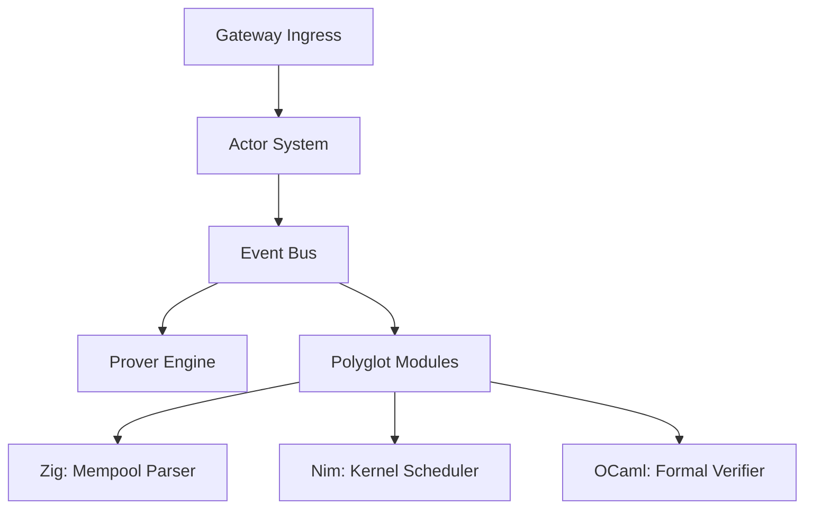

# Architecture

Kallipolis ZK utilizes a high-performance, microkernel-based architecture designed for low-latency ZK-proof generation and robust transaction fire-walling.

## System Diagram

## High-Level Component Details
- **Gateway**: Serves as the primary API ingress point, handling authentication and rate-limiting. Built using `axum` (Rust).
- **Actor System**: Orchestrates async tasks and facilitates inter-component communication. Based on the actor model, ensuring isolation and fault tolerance.
- **Event Bus**: High-throughput messaging backbone connecting microservices (e.g., `ActorSystem` -> `Prover`).
- **Prover Engine**: The core ZK-prover using `Halo2`. Requires significant computational overhead, handled via a dedicated pool.
- **Polyglot Modules**:
  - **Zig**: Mempool parser (low-level parsing of raw transaction data).
  - **Nim**: Kernel modules for real-time task scheduling.
  - **OCaml**: Formal verification engine ensuring mathematical correctness of the ZK circuits.
